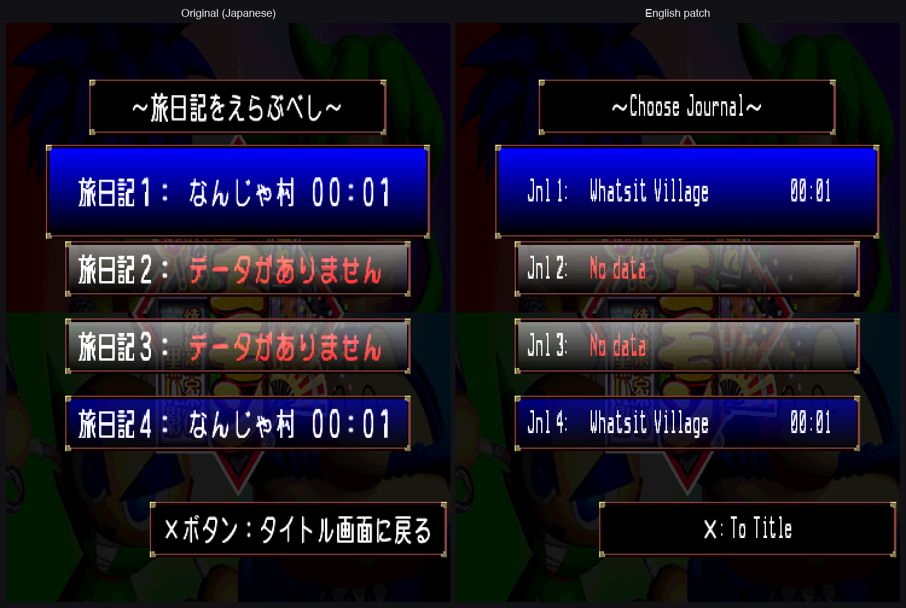
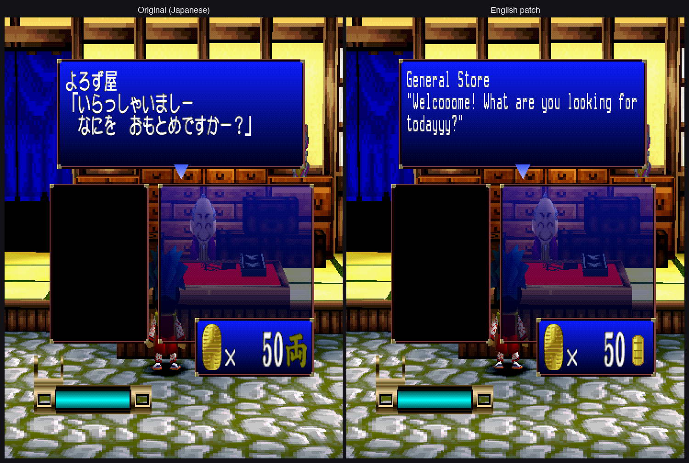
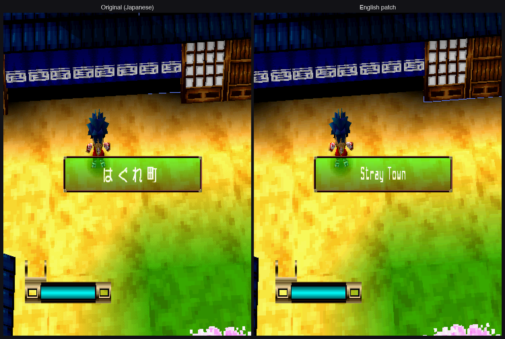
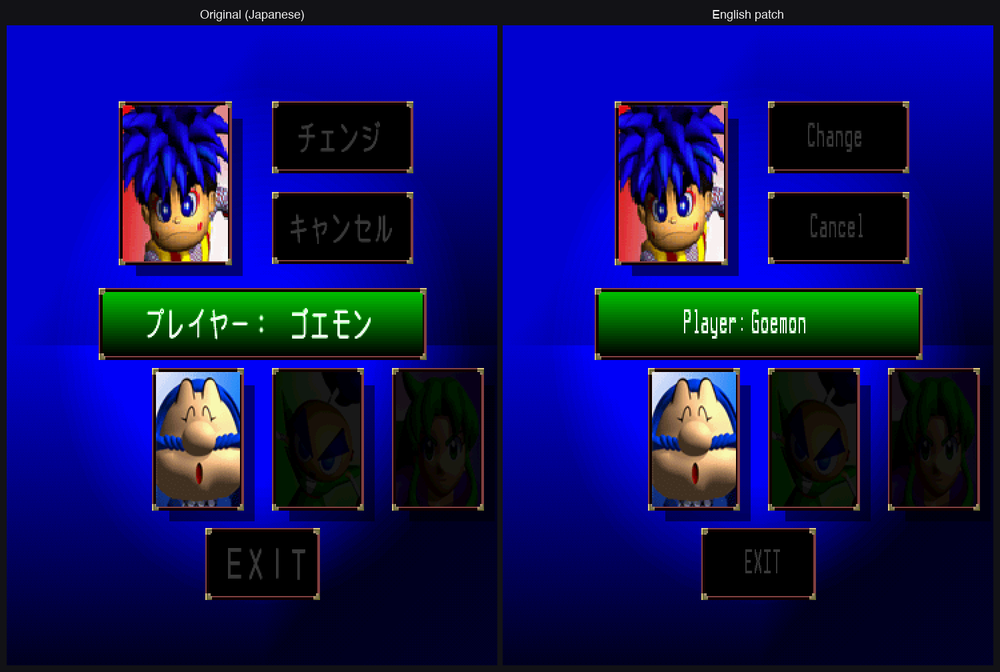
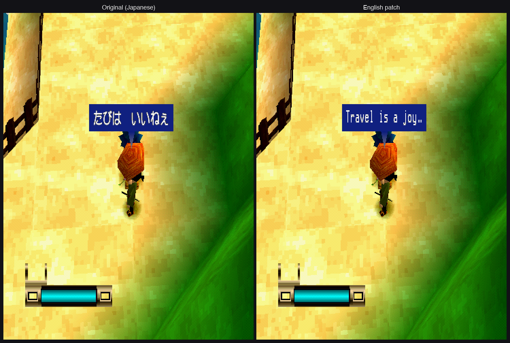

# Mystical Ninja: Shadey Business

An English fan translation of **がんばれゴエモン　来るなら恋！綾繁一家の黒い影**
(*Ganbare Goemon: Kuru nara Koi! Ayashige Ikka no Kuroi Kage*), Konami / KCE Nagoya, 1998,
for the PlayStation (**SLPM-86155**).

Free, unofficial, make sure to support any and all official ganbare goemon releases. 

**This repository contains no game data.** 
This is to patch copy of the game you already own; nothing here is useful without it.



## What it looks like

| | |
|---|---|
|  |  |
|  |  |

Original Japanese on the left, English on the right, same frame on both.

## About the translation

The series is titled *Mystical Ninja* here, and the characters use the names the N64-era
official English releases gave them: **Goemon, Ebisumaru, Sasuke, Yae, Impact**. That way this
aligns with *Mystical Ninja Starring Goemon* for fans of the series who were introduced to the series like I was through that game.

**Translated:** all in-game text (dialogue, speaker names, shop and inn menus, items and
techniques, signs, the system and memory-card messages), plus the English title cards and a
repainted road-safety charm in the opening movie.

**Credited in the game:** a line on the title screen, beside the logo, and a card held
after the ending credits with this repository's address. Konami's own credits roll is
untouched — same strips, same timing, same final card — and the card appears only once it
has finished and faded.

**Not translated, deliberately:** the voiced scenes stay Japanese. They are audio-only
streams with no text layer to hook, so subtitling them would mean inventing one the original
never had. The opening theme likewise has no subtitles.

## How to patch

You need:

- **Your own rip of the original Japanese disc**, SLPM-86155, as a raw `.bin` + `.cue`
  (single track, 400,750,224 bytes).
- **Python 3.6 or newer.** It comes with macOS and most Linux distributions. On Windows,
  install it from <https://www.python.org/downloads/> or the Microsoft Store.

Nothing else. The patcher uses only Python's standard library.

1. Download the latest release from the [Releases](../../releases) page and unzip it. Keep
   the three files together: `patch_goemon.py`, `kgd.py` and `goemon-en.ggp`.
2. Run it on your `.bin`:

   ```
   python3 patch_goemon.py "Ganbare Goemon - Kuru nara Koi! Ayashige Ikka no Kuroi Kage (Japan).bin"
   ```

   On Windows, type `py` instead of `python3`. An optional second argument sets the output
   folder; by default the English disc is written next to your original.
3. Load the new `goemon-en.cue` in your emulator.

It takes about 20 seconds on a recent machine and needs about 450 MB of free space. **It never
changes your original file**, and it never overwrites an existing one.

**What it does:** it checks that your disc is exactly the right one before writing anything.
Then it reads the game's files from your disc, applies this project's changes, and writes the
English disc. Last, it checks the result against the known-good English build; if anything
doesn't match, it deletes the partial file and tells you, rather than leaving you a broken
disc.

### Which disc

Your `.bin` must have this SHA-256:

```
ac9b90786336286f443af9c2a6591ae3cf6cdc34253b2dc65f0662a8be88148b
```

It matches the [Redump](http://redump.org/disc/8361/) dump of SLPM-86155 (CRC-32 `f70c9728`,
MD5 `b498fabf290394d1e6f2e949942ef05`, SHA-1 `19cf17fab427f416f315babaef817ca4f5d0a590`). The
later *Konami the Best* reprint (SLPM-86572) is a different pressing and has not been tested.

The patched disc will have SHA-256
`11244d45f9f13c751d139f385d319beccd2223096406f17f9cfa41cf53dfb84b`.

### If it says your disc doesn't match

| message | what to do |
|---|---|
| `This is not the disc this patch was made for.` | Wrong region or pressing, or a bad or modified dump. Re-rip, and compare with the Redump hashes above |
| `This disc is already the English version` | You gave it the patched output; use the original Japanese `.bin` |
| `That is the .cue file.` | Give it the `.bin` |
| `...a 2048-byte-per-sector .iso image` / wrong size | You need a raw 2352-byte-per-sector `.bin`, not an `.iso` or a converted image |
| `Not enough disk space` | Free about 450 MB where the output goes |
| `...already exists` | Move the previous output out of the way |
| `The patch data file is damaged` | Download the release again |

## Emulators and hardware

- **DuckStation** and **PCSX-Redux** work. On Apple Silicon, PCSX-Redux needs its
  interpreter mode; that's a known issue with this game regardless of the patch.
- **MiSTer FPGA:** put the `.bin` and `.cue` in their own folder under `games/PSX/`. The PSX
  core picks the Japanese BIOS automatically for this disc, just as it does for the original.
- **Real hardware and CRTs:** the English font is drawn with every stroke two lines thick,
  so each half of the game's interlaced picture carries the whole letter. An earlier,
  thinner font disappeared on a real PS1 into a CRT (`t` read as `L`, `e` as `a`); this one
  was checked on that same television. The patch changes text and graphics, not timing.
- **Don't load an emulator save state made on the Japanese disc or on an older version of
  the patch**; the game's data has moved, and it will crash. Memory-card saves are fine.

## Changes

- **v1.0:** first release.

## Known issues

- In five voiced scenes, the English text finishes typing about half a second after the
  Japanese voice line ends. Each line still waits for the previous one, so it never drifts
  further behind; closing the gap would have meant cutting names or meaning from lines that
  are already tight.

Found something else? Please [open an issue](../../issues/new/choose): a screenshot and
where you were in the game help most.

## Credits

Produced by **Dst0rtr**, who made every charter decision: the scope, the naming canon, the
adaptation style, and the title.

Translation, editing, review, reverse engineering, tooling and testing were carried out by a
team of AI agents, each with a separate role: translator, fidelity
reviewer, editor, reader-critic, rom-hacker, tech-auditor, build-engineer, playtester and
lore-researcher. The game's compressed data archive, its three text engines and the disc
rebuild were reverse-engineered for this project from scratch; there was no prior public
documentation of this game's formats.

No earlier English translation of this game exists. I wanted to produce this to bring this game to more English speaking goemon fans.

## Legal

*Ganbare Goemon* and all related names, characters and assets are © Konami. This is an
unofficial, non-commercial fan project, not affiliated with or endorsed by Konami.

The patch data contains only this project's own work (translated text, new graphics, and
code changes). Everything that belongs to the game is read from your own disc while the
patcher runs, and is never included in this repository or its releases. **Do not ask for,
share or post game images (ISOs, BINs) here.** Such requests will be closed.

This project will be withdrawn on request of the rights holder.

The patcher's source code is released under the MIT License (see `LICENSE`).
